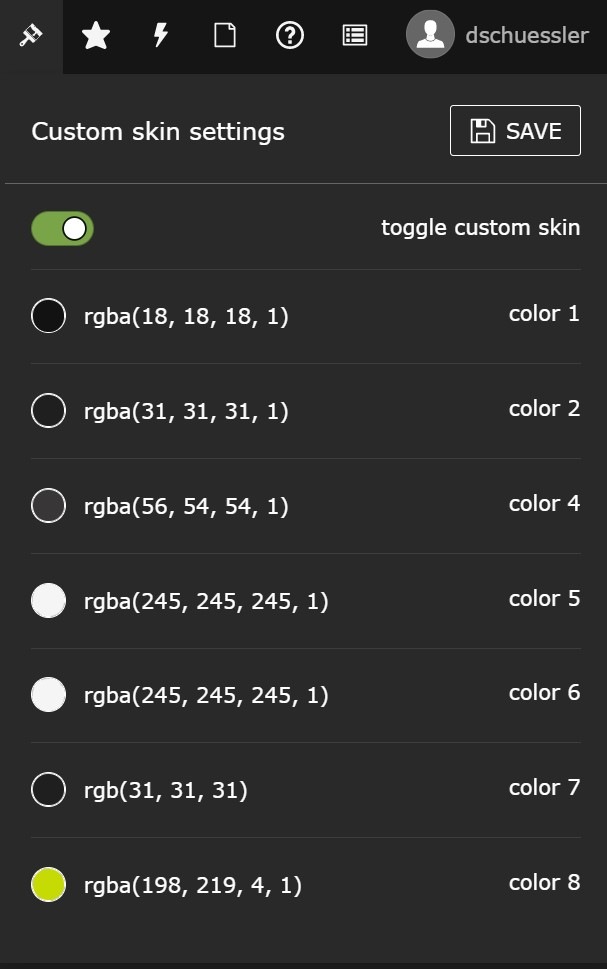

    

# TYPO3 extension *skins*

## Skins
This extension adds a dark skin (dark theme) to the TYPO3 backend. The colors are customizable and can be changed to your favorite colors.

All notable changes to this project will be documented in the [Changelog](CHANGELOG.md) file.

## Available Skins
- Light (TYPO3 default skin)
- Dark (default if enabled)
- Custom (you can choose your own colors for your backend)

## Usage
1. Click on the paint brush in the top bar
2. Choose your skin and enabled it by clicking on the toggle button

     
