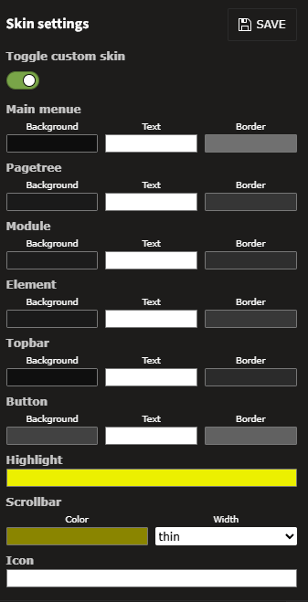

    

# TYPO3 extension `skins`

## Skins

This extension adds a dark skin (dark theme) to the TYPO3 backend. The colors are customizable and can be changed to
your favorite colors.

All notable changes to this project will be documented in the [Changelog](CHANGELOG.md) file.

## Available Skins

- Light (TYPO3 default skin)
- Dark (default if enabled)
- Custom (you can choose your own colors for your backend)

## Usage

1. Click on the paint brush in the top bar
2. Choose your skin and enabled it by activating the toggle

    

## save-and-close

- You can enable the save-and-close button in the "Extension Configuration (Global Configuration)"
    - Admin Tools -> Settings -> Configure extensions -> skins -> basic.saveAndCloseEnabled
    - default value is 0

## preview renderer

- You can enable preview renderer for textmedia and textpic in the "Extension Configuration (Global Configuration)"
    - Admin Tools -> Settings -> Configure extensions -> skins -> basic.enableCustomPreviewRenderer
    - default value is 0

## Features planned

- load default color settings
- create and save configurations in different slots
- export / import color configurations
- create new color configurations
